# ML4OCRP

## 摘要

ML4OCRP（Machine Learning for Optimal Cell Ratio Prediction，最优细胞比例预测的机器学习）为一个随机分化系统推荐细胞比例，并告诉每个细胞群该比例预计何时出现。可达到的比例是一个小的离散集合，这里按十个来处理。把每个候选都测一遍代价很高，而且每个细胞群看到的是一段短而带噪声的轨迹，不是一个单独的数。ML4OCRP 拟合已经测到的比例–分数关系，给出一个全局更优的比例，并用预测不确定性选择下一个值得采样的比例。

## 为什么要做 OCRP

项目给出了一套测定多个比例的方案。See our Measurement page。测得的仍然是少量离散的比例–分数关系，因此无法得知什么时候才达到最好的分数。ML4OCRP 就是补上这个缺口的软件。它用项目方法测得的离散比例–分数数据，预测全局最佳点。

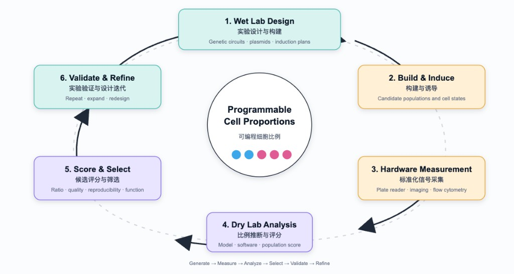

**Figure 1.** ML4OCRP 在第 4 步和第 5 步：把测到的比例变成分数，并选出下一次要采样的比例。给这两步提供数据的测量是第 3 步。See our Measurement page。See our Hardware page。

鼠标悬停在 Figure 1 的某一块上时，打开下面对应的卡片。触摸屏没有悬停，点一下应打开同一张卡片。

**1. 实验设计与构建。** 这一步决定要做的线路、质粒和诱导方案，目标是产生两种细胞状态。软件不设计这段 DNA。它只需要方案给出一组可以要求构建去达到的比例。后面用到的十个比例，从 0.5 到 6 间隔开，就是这张清单。

待画的图。一张卡片上三行：一个盒子标着启动子、BxB1 和两种状态标记；质粒画成圆，只用同样的标签，不写序列；表格的列是诱导剂、剂量、时间和目标比例。只填写比例一列，从 0.5 到 6，其余格子留空。Alt：一个线路盒子、一个标了字的质粒圆圈，以及比例列从 0.5 排到 6 的诱导表。不要画胶图、序列或元件编号，这一页没有这些材料。

**2. 构建与诱导。** 构建好并诱导之后，一份培养就是一个细胞群。记录下来的是比例对时间的一段短而带噪声的轨迹，不是一个最终的数。本页的检查用 40 个细胞群，24 小时的比例落在十个目标之一附近。

图。用 Figure 3。它已经是这一步的图：一个点是一个细胞群，灰线是十个目标。拍培养瓶不能看出比例。

**3. 硬件测量。** 必须有东西把物理信号变成比例。这一块写出的计划读数器是酶标仪、成像和流式细胞术。See our Measurement page。本页写好的分析是色素混合测试：phyphox 的色相和饱和度，用该批次的全黄和全蓝缩放，再由一条逻辑斯蒂读成蓝色体积分数。See our Hardware page。

图。用 Figure 16。在那些记录出现之前，不要画流式细胞仪或酶标仪。

**4. 干实验分析。** 这里有两个问题，由两个工具分别回答。建模组推导了 BxB1 重组方程。时间查询拟合这个方程，再拟合残差，问一个细胞群何时达到目标比例。ML4OCRP 只学习分数对比例，同时给出预测分数和不确定性。曾经试过用一个网络做这两件事，两件都学不好，所以分开了。

图。用 Figure 7。悬停时应指向两个读出，后验均值和 UCB，时间查询不要画进这张图。

**5. 候选评分与筛选。** 分数是项目要最大化的量。它可以是对称单峰、偏的单峰、双峰、上升的 S 形或一条直线。后验均值指出预测分数最高的比例。UCB 是均值加上 β 乘标准差，β = 2，指出下一次要测的比例。在 24 小时的检查里，单峰和单调函数与真实最优相差不超过 0.03。双峰是松的那一个：预测比例 3.73，真实峰在 4.00，分数损失 0.21。

图。五张拟合用 Figure 5。卡片若放得下误差汇总，再用 Figure 6。两张图都已经有了，新画一张只会重复。

**6. 实验验证与设计迭代。** 第 5 步选出的比例是下一次实验，送回湿实验，作为又一次诱导或又一个要构建的细胞群。双峰这种松的结果说明的是下一步测哪里。本页停在这一轮之前，这里没有第二批数据。

待画的图。把循环收成两块：评分与筛选把一个数，也就是 UCB 比例，交给湿实验那一块，湿实验那一块保持空白。Alt：一个箭头从评分与筛选指向湿实验，箭头上写着一个比例。不要画菌落，也不要画前后对比图。

每个细胞群有一个编号。随时间记录成两张对齐的表：一张是细胞比例（`id`、`time`、`ratio`），一张是对应的实验分数（`id`、`time`、`score`）。比例是两种分化细胞的相对丰度。分数是要最大化的目标。

在十个离散比例上查表，说不出已经测到的比例之间会发生什么，也说不出哪个还没测的比例最能降低不确定性。第一个模型试图在一个网络里同时学习两种关系。这没有成功：最优比例本身预测得很差，让同一个模型再兼顾比例如何随时间变化，效果同样不好。预测最优比例是主要任务，所以这两件事被分开。

- **OCRP** 只学习分数作为比例的函数。深度核高斯过程同时给出预测分数和不确定性，因此同一个模型既能指出预测的最优比例，也能推荐下一次实验。
- **时间查询**是单独的。给定目标比例，它问每个细胞群：这个比例是已经出现过，还是会在以后出现，还是在搜索范围内到不了。当前的查询拟合建模组的 BxB1 重组常微分方程，并在其上再拟合一个残差。把这个机理模型和软件结合起来，从一开始就是目标；当前这个版本实现了它。

## 优化迭代

- **版本 1.0**

  第一版规定了数据约定，并建立了一个联合模型。比例表和分数表在 `(id, time)` 上做内连接，按细胞群分组，再打包成 `(time, ratio, score)` 的填充张量。Transformer 编码器（`TimeAttentionEncoder`）把每条长度不一的轨迹压成一个全局特征，用的是类似 BERT `[CLS]` 的可学习标记。这个特征在每个时间点上重复，与当前比例拼接，送入深度核高斯过程（`DeepKernelGP`）预测分数。后验上的上置信界（UCB）再建议下一个要采样的比例。当时的意图是让一个模型同时吸收比例的时间过程和比例–分数映射。

- **版本 2.0**

  程序拆成若干命令行模块：预处理、模型定义、训练辅助函数、训练、比例推荐，以及按细胞群的时间查询。拆开是为了把代码组织清楚，一个文件承担一件事。每件工作都可以带自己的参数运行。网络仍然是 `TimeAttentionEncoder` 加 `DeepKernelGP`。

  加入 `RatioTimePredictor`，是因为把时间留在注意力模型里效果不好。它对每个细胞群拟合一个从时间到比例的 scikit-learn 高斯过程。查询先在历史时间里找与目标比例相差不超过容差的点。若没有，就沿预测均值向未来搜索，返回最早的交叉时刻，或报告该比例没有达到。

- **版本 3.0**

  最优比例的预测仍然不好。因为这项预测是主要任务，OCRP 被收窄为比例–分数映射。`TimeAttentionEncoder` 换成 `RatioFeatureEncoder`：它把一个比例标量嵌成向量，并用一个辅助分数头做预训练。填充轨迹张量和保存下来的全局特征随旧编码器一起去掉。时间过程仍留在 `RatioTimePredictor` 里。

- **版本 4.0（最终版）**

  时间查询是机理模型进入软件的地方。从一开始，目标就是把建模组的 BxB1 重组常微分方程和 ML4OCRP 结合起来；做到这件事的是当前这个版本。对每个细胞群，预测器先拟合这条常微分方程，再拟合残差高斯过程或多项式，而不再只用时间上的高斯过程。

  为每个细胞群拟合常微分方程很慢，所以 `query_per_id.py` 在没有传入 `--fit_ode` 时不开启它。`Val.sh` 会传入。`app.py` 调用同一套 `Model/` 实现。这个界面既给不跑命令行的队员用，也用于展示。在浏览器里，按细胞群的查询一次处理一个群，这样页面可以显示进度。它不启动命令行查询所用的进程池。

## 进一步了解 ML4OCRP

OCRP 预测一个可能还没被测到的比例的分数。

1. **预训练编码器。** `RatioFeatureEncoder` 把比例标量依次送过线性层（1 到 32）、ReLU 和线性层（32 到 16）。这个 16 维嵌入上的线性头预测分数。这一阶段只是让编码器学到有用的表示。
2. **冻结编码器。** 分数头不再使用。每一对训练样本变成 17 维向量 `[ratio | embedding]`。
3. **拟合深度核高斯过程。** 一个多层感知机（17 到 32，ReLU，32 到 8）把该向量映射到潜在空间。一个精确高斯过程放在这个空间里，均值是零均值，核是自动相关决定的 RBF 核，观测噪声是高斯的。训练最大化精确边际似然。
4. **用两种方式读取后验。**
   - 预测的最优值在比例区间 `[0.01, 5]` 上，用多起点梯度步最大化后验均值。
   - 下一次实验在 `[0.1, 10]` 的网格上最大化 UCB，即 `mean + β · std`，其中 `β = 2`。

时间查询不经过这个网络。对每个细胞群，它拟合 BxB1 动力学参数，对常微分方程与观测比例之间的残差建模，再搜索预测比例达到目标的时刻。结果是一个时间和一个状态：`-1` 表示该比例已在记录的历史中出现，`1` 表示预测出现在未来，`0` 表示没有达到。

## 工作流（用流程图替换；悬停交互仍待实现）


**Figure 2.** 硅基核对从 24 小时的合成比例开始，经过训练和按细胞群的时间查询，再到预测时刻上的常微分方程比较。

合成比例表里，细胞群的数量多于目标比例的数量。每个细胞群在 24 小时的比例落在十个值附近，这些值从 0.5 到 6 对数间隔。然后由 `fitting_score.py` 给这些比例打分。不同打分函数的对比见[打分函数形状](#打分函数形状)。

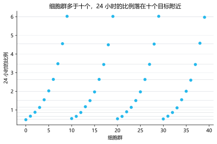

**Figure 3.** 每个细胞群在 24 小时的比例落在十个目标之一附近，目标从 0.5 到 6 对数间隔。

## 打分函数形状

`fitting_score.py` 可以用五种函数把同一批比例变成分数。默认仍是对称高斯，因此不传 `--score_fn` 的调用保持不变。

| `--score_fn` | 形状 | 公式 |
| --- | --- | --- |
| `gaussian` | 在 `--opt_ratio` 处的对称单峰 | `max_score * exp(-((ratio - opt_ratio)^2) / (2 * sigma^2))` |
| `log_gaussian` | 在 `--opt_ratio` 处的不对称单峰 | 同一个高斯，自变量换成 `log(ratio)` |
| `bimodal` | 峰值在 `--opt_ratio` 和 `--opt_ratio_2` | 两个高斯的加权和，缩放后较高的峰等于 `--max_score` |
| `sigmoid` | 递增的 S 形，中点为 `--opt_ratio` | `max_score / (1 + exp(-(ratio - opt_ratio) / sigma))` |
| `linear` | 直线上升 | `--linear_min` 处为 0，`--linear_max` 处为 `--max_score`，区间外截断 |

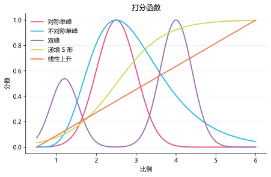

**Figure 4.** 同一次检查用五种形状给同一批比例打分：两个单峰、一个双峰、一条递增 S 形和一条直线。

`test_score_shapes.py` 生成一份比例表（40 个细胞群，24 小时的比例落在十个默认目标附近，种子 0），再用每种函数打分。然后按默认日程训练 OCRP：预训练 100 轮，高斯过程 200 轮，种子 0。预测的最优比例是在 `[0.5, 6]` 上最大化后验均值，区间与目标比例相同。分数损失是真实函数在真实最优点的分数减去在预测比例上的分数。分数 RMSE 比较的是后验均值和这个区间上的真实打分函数。

| 打分函数 | 真实最优 | 预测最优 | 绝对误差 | 分数损失 | 分数 RMSE | UCB |
| --- | ---: | ---: | ---: | ---: | ---: | ---: |
| 对称高斯 | 2.50 | 2.51 | 0.006 | 0 | 0.010 | 2.50 |
| 对数高斯 | 2.50 | 2.48 | 0.025 | 0.0004 | 0.010 | 2.44 |
| 双峰 | 4.00 | 3.73 | 0.27 | 0.207 | 0.077 | 3.72 |
| Sigmoid | 6.00 | 6.00 | 0 | 0 | 0.004 | 6.00 |
| 线性 | 6.00 | 6.00 | 0 | 0 | 0.031 | 6.00 |

对称单峰、不对称单峰、sigmoid 和线性上升与真实最优相差不超过 0.03，分数损失不超过 0.0004。双峰更松：预测比例是 3.73，较高的峰在 4.00，分数损失为 0.21。同一次拟合的 UCB 推荐是 3.72。

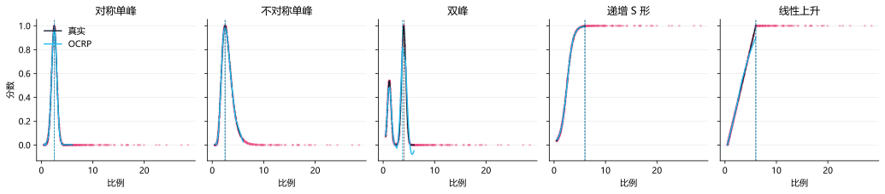

**Figure 5.** 单峰和单调函数被收回来了。双峰是松的那一个：预测比例 3.73，较高的峰在 4.00。

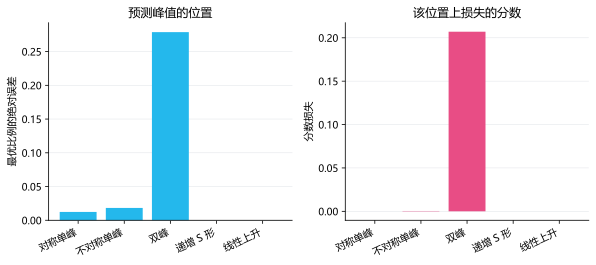

**Figure 6.** 除双峰外，绝对误差都在 0.03 以内。双峰的分数损失是 0.21。

## 架构（用架构图替换；悬停交互仍待实现）


**Figure 7.** 预训练之后，高斯过程读的是原始比例和冻结嵌入的拼接。均值和 UCB 是同一个后验的两种读法。

## 环境依赖

`Val.sh` 需要一个名为 `ocrp` 的 conda 环境。直接跑脚本或图形界面也需要同样的包。本仓库没有固定版本号。

| 包 | 用途 |
| --- | --- |
| Python 3 | 全部脚本 |
| NumPy | 数组和 `.npy` 字典 |
| pandas | CSV 表 |
| PyTorch | 编码器、高斯过程张量，以及设备选择 |
| GPyTorch | 精确深度核高斯过程 |
| SciPy | 时间查询和硅基脚本中的常微分方程积分与参数拟合 |
| scikit-learn | 时间查询中的残差高斯过程 |
| tqdm | 按细胞群查询时的进度显示 |
| Matplotlib | `InSilicoValidation/test_score_shapes.py` 写出的图 |
| Streamlit | 仅 `app.py` |

在 Windows 上，PyTorch 和 NumPy 所用的 Intel OpenMP 运行时可能在导入时中止。图形界面在导入它们之前设置 `KMP_DUPLICATE_LIB_OK=TRUE`。若命令行出现同样的中止，运行前设置同一个变量。

省略 `--device` 时，训练和按细胞群查询依次选择 MPS、CUDA、CPU。比例推荐依次选择 CUDA、CPU。

## 如何使用

在 Unix shell 中运行整条流程前，先改 `Val.sh` 顶部的 `PROJECT_ROOT`。它会激活 `ocrp`，并用默认参数跑完七步。不额外传入可选参数时，数值默认值和输出路径保持不变。

```bash
bash Val.sh
```

Python 脚本从自己所在目录解析 `../Data`，检查点在 `Data/Model`，因此要在 `Model/` 或 `InSilicoValidation/` 里运行，而不是在仓库根目录。实验数据的运行不生成合成数据，也不做最后的常微分方程核对：

```bash
cd Model
python preprocess_data.py
python ocrp_model_train.py
python predict_ratio_and_recommend_by_ucb.py
python query_per_id.py --fit_ode
```

除非传入 `--fit_ode`，否则它是关闭的，因为为每个细胞群拟合常微分方程很慢。`Val.sh` 会传入它。其余超参数都是带默认值的可选参数。完整列表，包括类型和说明，在 `Model/SCRIPT_ARGUMENTS.md`。常用的覆盖项是 `--d_model`、`--hidden_dim`、`--n_epochs` 和 `--beta`。

## 图形界面：WebOcrp

在仓库根目录、同一环境已激活时：

```bash
streamlit run app.py
```

这个页面既让队员不通过命令行运行流程，也用来展示同一套软件。它导入 `Model/`，因此训练和查询的模型与命令行相同。两边写出的检查点，在 `hidden_dim` 保持默认值 32 时可以互相读取。

工作台有四个标签页。

1. **预处理。** 上传两份 CSV，指定本地文件，或加载已有的 `id_data_dict.npy`。合并成功后，所有比例–分数对画在一张散点图上，横轴是比例，纵轴是分数。

   

   **Figure 8.** 预处理页接收比例表和分数表，或者一份已有的 `id_data_dict.npy`。

   

   **Figure 9.** 合并之后，每一对比例和分数都画出来，横轴是比例，纵轴是分数。

2. **训练。** 拟合编码器和深度核高斯过程。页面上可以设置宽度、预训练、验证集比例和边际似然的归约方式。

   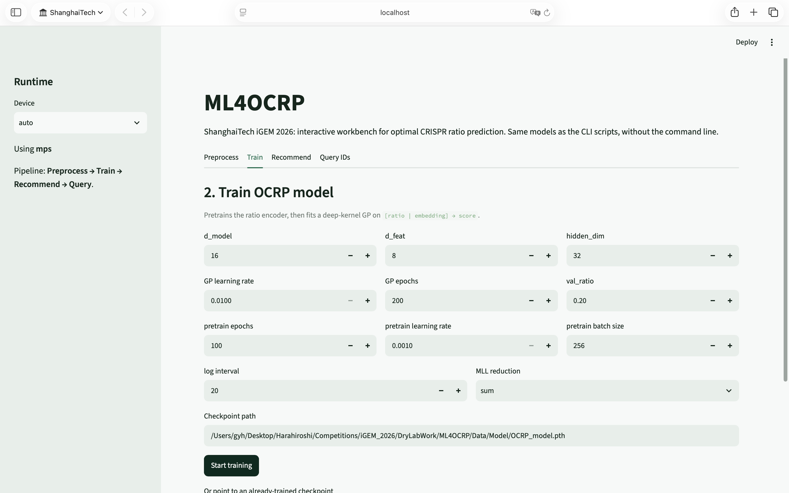

   **Figure 10.** 训练用的编码器和深度核高斯过程与命令行相同。

   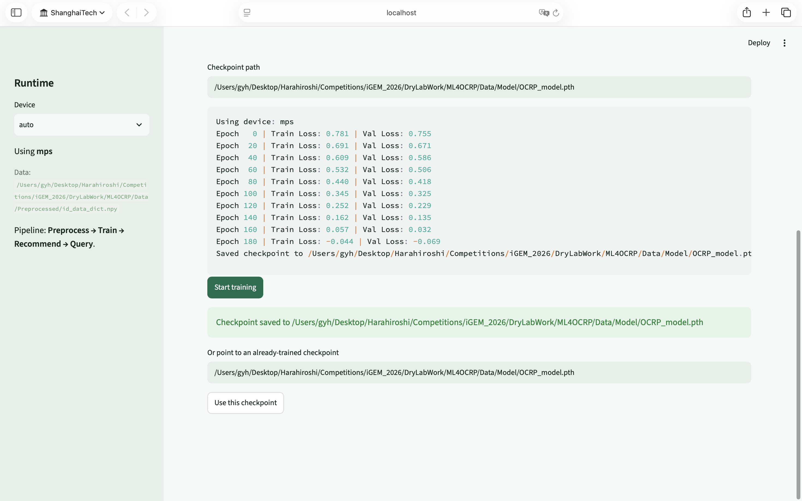

   **Figure 11.** 跑完会写出 `OCRP_model.pth`。`hidden_dim` 保持 32 时，命令行脚本可以读这份检查点。

3. **推荐。** 加载 `OCRP_model.pth`，报告使预测分数最大的比例，并报告 UCB 推荐。页面同时画出均值、标准差和 UCB 对比例的曲线。

   

   **Figure 12.** 推荐在后验均值上找最优比例，并在网格上计算 UCB。

   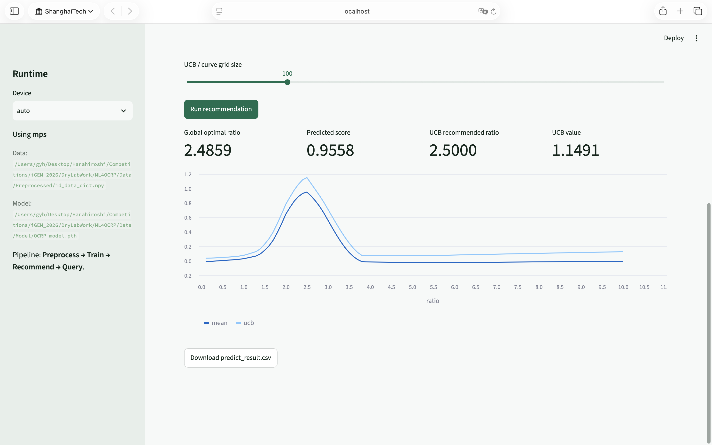

   **Figure 13.** 画出的均值是预测分数。UCB 曲线是均值加上 β 乘标准差，标出下一次要采样的比例。

4. **查询。** 对推荐的比例，或对你输入的比例，拟合每个细胞群并返回时间和状态。这一页一次处理一个群，以便进度条更新。它不启动 `query_per_id.py` 所用的进程池。

   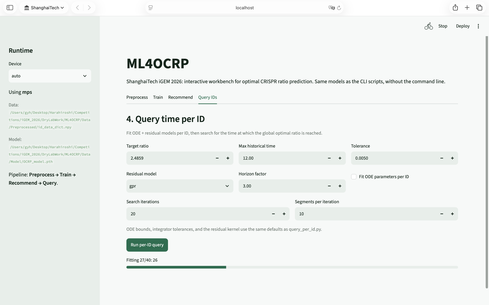

   **Figure 14.** 查询一次处理一个细胞群，页面才能显示进度。它不启动命令行用的进程池。

   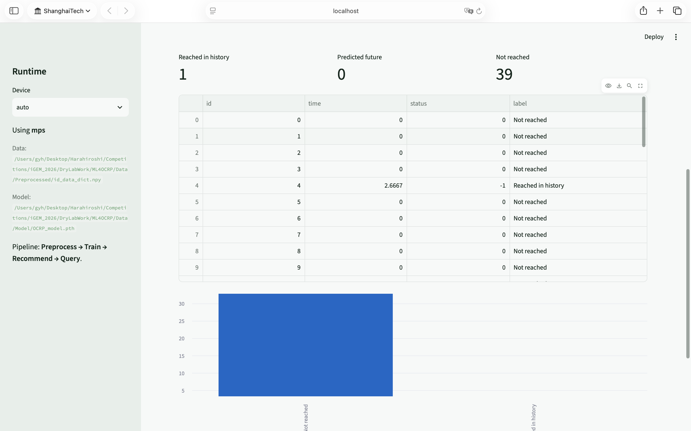

   **Figure 15.** 每个细胞群返回一个时间和一个状态：已经出现、预测在未来，或没有达到。

# Hardware

## 摘要

给硬件色素混合测试用的软件分析。See our Hardware page。phyphox 记录的蓝、黄色素溶液颜色被换成蓝色体积分数。See our Measurement page。

两组 phyphox 实验把蓝色和黄色母液按已知体积比混合。两组母液的初始浓度不同，相机曝光也不同，所以直接用 Hue 和 Saturation 拟合的一张平面不能从一组用到另一组。

CalcRatio 把每组自己的全黄（`ratio = 0`）和全蓝（`ratio = 1`）当作颜色端点。样品先写成相对这两个端点的位置 `z_hue` 和 `z_saturation`，再用一条两组共用的逻辑斯蒂曲线预测蓝色体积分数。63 个样品上，共用模型的 `R-squared = 0.801`，`RMSE = 0.118`。同一批数据上，原始 Hue–Saturation 平面的 `R-squared = 0.638`。

实验 1（`data/1_*`）有 5 个阶段，模型使用第 2 阶段（21 个样品）。实验 2（`data/2_*`）只有 1 个阶段，使用该阶段（42 个样品）。

这是第二次拟合。第一次只用 Hue 和 Saturation，每个批次都要单独拟合一条。把该批次的全蓝和全黄加进去之后，一条曲线才能同时盖住两个批次。两步写在「优化迭代」一节。

## 为什么用这条流程

硬件要的是可以跨批次比较的体积分数。手机记下的是色相和饱和度。混合实验里的两件事决定了模型的形式。

母液浓度或曝光一变，同一个体积比就不会落在同一个色相和饱和度上。该批次实测的全黄和全蓝带着这些变化。用这两个读数缩放色相和饱和度之后，两组进入同一个坐标系：该组全黄为 0，该组全蓝为 1。

蓝色体积分数在 0 和 1 之间。样品从黄移向蓝时分数上升，靠近两种纯母液时上升变缓。对缩放后的色相和饱和度做逻辑斯蒂，就是这个形状。拟合方程以及和第一张平面的对比写在「优化迭代」一节。

下面的默认路径相对于仓库根目录。脚本从包含 `scripts` 的文件夹解析这些路径，因此不依赖当前工作目录。命令行上传入的相对路径仍然相对于工作目录。下面的命令在仓库根目录运行。

```bash
python scripts/build_id_ratio_dict.py
python scripts/data_preprocess.py
python scripts/data_preprocess.py -i data/1_original \
                                  -o data/1_processed \
                                  --dict_file data/1_settings/mapping.npy \
                                  -n 5 \
                                  --key_stage 2
python scripts/fit_model.py
```

第一条预处理命令是实验 2（一个阶段）。第二条是实验 1（五个阶段，保留第 2 阶段）。

## 优化迭代

预测式改过一次。第一版方程只看样品颜色，每个批次都要重新拟合。第二版同时看该批次的全蓝和全黄，一次拟合两组共用。

- **版本 1：Hue 和 Saturation，每个批次一张平面**

  输入只有样品的 Hue 和 Saturation。每个实验各拟合一张平面：

  \[
    \mathrm{ratio} = a_0 + a_1\,\mathrm{Hue} + a_2\,\mathrm{Saturation}
  \]

  | 拟合 | \(n\) | \(R^2\) | \(RMSE\) |
  | --- | ---: | ---: | ---: |
  | 仅实验 1 | 21 | 0.805 | 0.134 |
  | 仅实验 2 | 42 | 0.856 | 0.091 |
  | 两批共用一张平面 | 63 | 0.638 | 0.159 |

  在一个批次内部，这张平面跟得上配制的体积分数。把两个批次强行放在同一张平面上，\(R^2\) 从大约 0.8 掉到 0.638，因为纯母液的颜色不同。浓度或曝光一变，就要重新拟合一组系数。

- **版本 2：Hue、Saturation、Blue 和 Yellow，跨批次一条曲线**

  Blue 和 Yellow 是同一批次里全蓝母液和全黄母液的色相与饱和度。它们先把样品重新缩放，再预测体积分数：

  \[
    \begin{aligned}
    z_{\mathrm{hue}} &= \frac{\mathrm{Hue} - \mathrm{Yellow\_Hue}}{\mathrm{Blue\_Hue} - \mathrm{Yellow\_Hue}} \\
    z_{\mathrm{saturation}} &= \frac{\mathrm{Saturation} - \mathrm{Yellow\_Saturation}}{\mathrm{Blue\_Saturation} - \mathrm{Yellow\_Saturation}} \\
    \mathrm{ratio} &= \frac{1}{1+\exp\left(-(-1.1397 + 1.4533\, z_{\mathrm{hue}} + 1.8247\, z_{\mathrm{saturation}})\right)}
    \end{aligned}
  \]

  三个系数在全部 63 行上估计一次。

  | 拟合 | \(n\) | \(R^2\) | \(RMSE\) |
  | --- | ---: | ---: | ---: |
  | 两批共用的逻辑斯蒂 | 63 | 0.801 | 0.118 |
  | 该曲线下的实验 1 | 21 | 0.781 | 0.142 |
  | 该曲线下的实验 2 | 42 | 0.815 | 0.103 |

  共用曲线比每个批次自己的 Hue–Saturation 平面略松，但比把两批放在同一张 Hue–Saturation 平面上紧得多。以后的批次保留这些系数，只需要在同样条件下测自己的全蓝和全黄，作为缩放用的 Blue 和 Yellow。

## 工作流与架构（用流程图替换；悬停交互仍待实现）

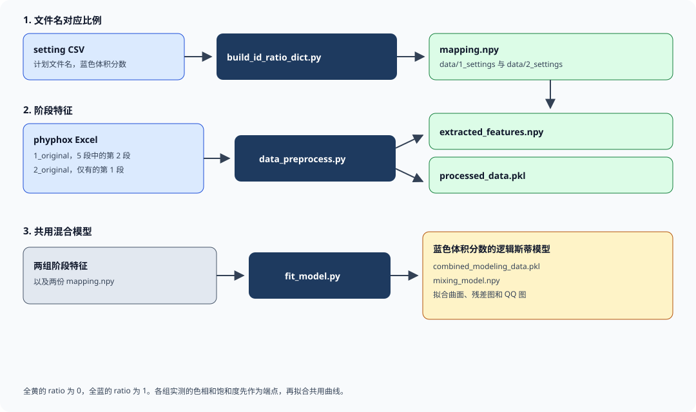

**Figure 16.** 两组 phyphox 实验的阶段特征先用各自的全黄和全蓝缩放，再拟合一条逻辑斯蒂。

## 环境依赖

Python 3.12 或更新版本。下面的包是三个脚本实际导入的。

| 包 | 用途 |
| --- | --- |
| `numpy` | 数组、圆周平均和 `.npy` 字典 |
| `pandas` | 表格、setting CSV 和 phyphox Excel |
| `openpyxl` | 通过 pandas 读取 `.xlsx` |
| `matplotlib` | 拟合曲面、残差图、预测对实测图和 QQ 图 |
| `scipy` | 逻辑斯蒂最小二乘，以及系数检验用的 t 分布 |
| `statsmodels` | Hue–Saturation 线性基线，以及残差 QQ 图 |

## 原始输出

`python scripts/fit_model.py` 打印下面的内容。残差是拟合比例减去实测比例。

```text
mixing model
z_hue        = (Hue - Yellow_Hue) / (Blue_Hue - Yellow_Hue)
z_saturation = (Saturation - Yellow_Saturation) / (Blue_Saturation - Yellow_Saturation)
ratio        = 1 / (1 + exp(-(-1.1397 + 1.4533 * z_hue + 1.8247 * z_saturation)))

parameters
                coef  std_err       t    p
intercept    -1.1397   0.1314 -8.6743  0.0
z_hue         1.4533   0.1538  9.4490  0.0
z_saturation  1.8247   0.2084  8.7550  0.0

R-squared: 0.8012
RMSE:      0.1176
baseline ratio ~ Hue + Saturation R-squared: 0.6375

pure yellow / pure blue endpoints
       Yellow_Hue  Yellow_Saturation  Blue_Hue  Blue_Saturation
group
1         177.788              0.791   215.408            0.990
2         107.502              0.272   210.154            0.586

fit by group
1: n=21  R-squared=0.7809  RMSE=0.1417
2: n=42  R-squared=0.8152  RMSE=0.1034

residual skew: 0.5731694436244197
residual kurtosis: -0.3345401332238507
```

保存的文件：

| 文件 | 内容 |
| --- | --- |
| `data/2_processed/combined_modeling_data.pkl` | 合并后的建模表，包括端点、归一化颜色和预测比例 |
| `data/2_processed/mixing_model.npy` | 三个系数，以及每个实验使用的阶段编号 |

## 读拟合结果

截距和两个颜色系数的 p 值都低于 0.001（残差自由度 60）。`z_hue` 和 `z_saturation` 都会把预测的体积分数推向蓝色一侧。

RMSE 0.118 大约是蓝色体积分数的十二个百分点。这次拟合的最大绝对残差是 0.257。用来核对两种母液下的硬件颜色通道是够用的。如果硬件要把体积分数读到几个百分点以内，这个误差就偏粗。

实验 2（n = 42）更紧：\(R^2 = 0.815\)，RMSE \(= 0.103\)。实验 1（n = 21）更松：\(R^2 = 0.781\)，RMSE \(= 0.142\)。残差偏度是 0.57，峰度是 -0.33，误差略偏向正侧，没有厚尾。

只在一个实验内部拟合的直线会稍紧一些（实验 1 大约 0.80，实验 2 大约 0.86）。那条直线属于一对母液和一次相机设置。共用逻辑斯蒂接受新的一对母液，前提是测过这对母液的全黄和全蓝。

端点颜色说明归一化在起作用：

| 实验 | 全黄色相 | 全黄饱和度 | 全蓝色相 | 全蓝饱和度 |
| --- | ---: | ---: | ---: | ---: |
| 1 | 177.788° | 0.791 | 215.408° | 0.990 |
| 2 | 107.502° | 0.272 | 210.154° | 0.586 |

实验 1 第 2 阶段的全黄是 177.8°，而蓝色比例 5%–25% 的样品大约在 126°–139°。全黄读数不在该阶段混合曲线的黄端，因此一部分 `z_hue` 会小于 0。同一批记录里，第 1 阶段的色相与比例相关约 0.94，第 2 阶段约 0.82。当前拟合按设定使用第 2 阶段。若第 2 阶段其实是另一种光照，端点需要重算。

母液浓度之比没有作为单独参数写入。会改变曲线的是两种强度之比，而在这两组数据上，这个比分不出来，它和逻辑斯蒂的截距混在一起。批次之间的颜色偏移已经由测到的端点带着。

## 读图

蓝圆是实验 1，橙三角是实验 2。


**Figure 17.** 预测分数对配制分数（n = 63）。落在红线上的点与共用曲线一致。实验 1 散得更开，与它 0.142 的 RMSE 相符。


**Figure 18.** `z_hue` 和 `z_saturation` 上的共用逻辑斯蒂。实验 2 在黄端和蓝端之间。实验 1 伸到 `z_hue = 0` 以下，因为它第 2 阶段的全黄不是这一系列里最黄的点。

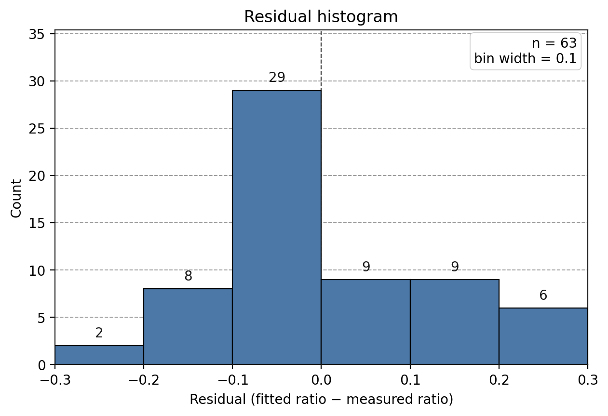

**Figure 19.** 残差大多在 ±0.2 以内。正侧更长的尾巴表示有些样品被估高了。残差偏度是 0.57。


**Figure 20.** 从低拟合分数到高拟合分数，残差都围着 0，没有明显的喇叭形。

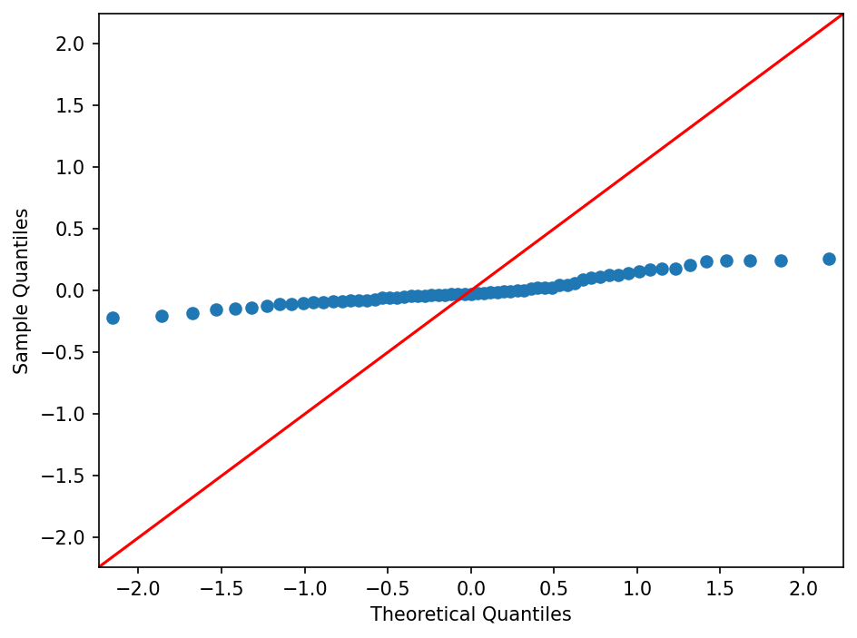

**Figure 21.** 正态 QQ 图和直方图一样有轻微右偏：上尾离开参考线。峰度是 −0.33。

# iHP

## 为什么做 Desktiny

Desktiny 是和人类实践、美术一起做的桌面宠物。这一页只写前期游戏逻辑。See our Human Practices page。

## 怎么玩

cc
