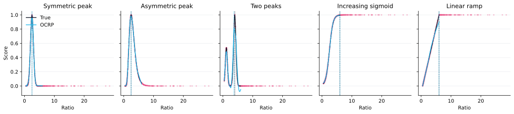
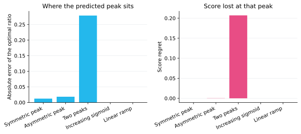

# ML4OCRP

## Abstract

Machine Learning for Optimal Cell Ratio Prediction (ML4OCRP) recommends a cell ratio for a stochastic differentiation system and tells each cell group when that ratio is expected. The attainable ratios form a small discrete set, treated here as ten. Measuring every candidate is expensive, and each cell group is observed as a short, noisy trajectory rather than a single number. ML4OCRP fits the ratio–score relationship that has already been measured, proposes a globally preferred ratio, and uses predictive uncertainty to choose the next ratio worth sampling.

## Why OCRP

The project provides a protocol for measuring several ratios. See our Measurement page. What it returns is still a small set of discrete ratio–score pairs, so those measurements alone do not show when the best score is reached. ML4OCRP is the software for that gap. It takes the discrete ratio–score data produced by the project method and predicts the global optimum.


**Figure 1.** ML4OCRP sits in steps 4 and 5: it turns a measured ratio into a score and chooses the next ratio to sample. The measurement that feeds those steps is step 3. See our Measurement page. See our Hardware page.

Hovering a box in Figure 1 opens the matching card. A touch screen should open the same card on tap, because that screen has no hover.

**1. Wet Lab Design.** This step chooses the circuit, the plasmid, and the induction plan that are meant to produce the two cell states. The software does not design that DNA. It only needs the plan to name ratios a construct can be asked to reach. The ten ratios used later, spaced from 0.5 to 6, are that list.

Picture to draw. Three rows on one card: a cassette labeled promoter, BxB1, and two state markers; a plasmid drawn as a circle with those same labels and no sequence; a table headed inducer, dose, time, and intended ratio. Fill only the ratio column, from 0.5 to 6, and leave the other cells blank. Alt: a circuit cassette, a labeled plasmid circle, and an induction table whose ratio column runs from 0.5 to 6. No gel, no sequence, and no part number, because this page does not have them.

**2. Build & Induce.** A built and induced culture is one cell group. What gets recorded is a short, noisy trajectory of ratio against time, not one final number. The check on this page uses 40 groups, and the ratio at 24 h lies near one of the ten targets.

Picture. Use Figure 3. It is already the drawing of this step: one point per group, gray lines at the ten targets. A photograph of a flask would not show the ratio.

**3. Hardware Measurement.** Something has to turn a physical signal into a ratio. The box names a plate reader, imaging, and flow cytometry as the planned readers. See our Measurement page. The analysis written here is the pigment-mixing test: phyphox Hue and Saturation, rescaled by that batch's pure yellow and pure blue, then read as a blue volume fraction by one logistic. See our Hardware page.

Picture. Use Figure 16. Do not draw a cytometer or a plate reader until those recordings exist.

**4. Dry Lab Analysis.** Two questions are answered here, by two different tools. The modeling group derived the BxB1 recombination equation. The time query fits that equation, then a residual, and asks when a cell group reaches the target ratio. ML4OCRP learns only score against ratio, and returns a predicted score together with an uncertainty. One network was tried on both jobs. It did not learn either well, so the jobs stayed separate.

Picture. Use Figure 7. The hover should point at the two readouts, the posterior mean and UCB, and leave the time query out of that drawing.

**5. Score & Select.** Score is whatever the project is maximizing. It can be a symmetric peak, a skewed peak, two peaks, a rising sigmoid, or a straight ramp. The posterior mean names the ratio with the highest predicted score. UCB, the mean plus β times the standard deviation with β = 2, names the next ratio to measure. In the 24 h check, the single-peak and monotonic scores land within 0.03 of the true optimum. The two-peak score is the loose case: predicted ratio 3.73, true peak 4.00, regret 0.21.

Picture. Use Figure 5 for the five fits, and Figure 6 if the card has room for the error summary. Both drawings already exist. A new chart would only repeat them.

**6. Validate & Refine.** The ratio from step 5 is the next experiment, sent back to the wet lab as another induction or another group to build. A loose result, such as the two-peak score, says where to measure next. This page stops before that round. There is no second data set here.

Picture to draw. A reduced loop: the score-and-select box hands one number, the UCB ratio, to the wet-lab box, and the wet-lab box stays empty. Alt: an arrow from the score-and-select box to the wet-lab box, with one ratio written on the arrow. No colonies and no before-and-after plot.

Each cell group has an identifier. Over time, it is recorded as two aligned tables: one of cell ratios (`id`, `time`, `ratio`) and one of the corresponding experimental scores (`id`, `time`, `score`). The ratio is the relative abundance of the two differentiated cell types. The score is the objective we want to maximize.

A lookup over the ten discrete ratios cannot say what happens between the ratios that were actually measured, and it does not say which unmeasured ratio would reduce uncertainty the most. The first model tried to learn both relationships in one network. That did not work: the optimal ratio itself was predicted poorly, and letting the same model also account for how ratio changes with time performed poorly as well. Predicting the optimal ratio is the main task, so the two jobs were separated.

- **OCRP** learns score as a function of ratio only. A deep-kernel Gaussian process returns both a predicted score and an uncertainty, so the same model can name a predicted optimum and recommend the next experiment.
- **The time query** is separate. Given a target ratio, it asks, for each cell group, whether that ratio was already seen, will be reached later, or is not reached inside the search horizon. The current query fits the modeling group's BxB1 recombination ODE and a residual on top of it. Combining that mechanistic model with the software was a goal from the start; this is the version that implements it.

## Optimization iteration

- **Version 1.0**

  The first version defined the data contract and a joint model. Ratio and score tables were inner-joined on `(id, time)`, grouped by cell group, and packed into a padded tensor of `(time, ratio, score)`. A Transformer encoder (`TimeAttentionEncoder`) compressed each variable-length trajectory into one global feature, using a learnable token in the style of BERT's `[CLS]` token. That feature was repeated at every time point, concatenated with the current ratio, and passed to a deep-kernel Gaussian process (`DeepKernelGP`) that predicted score. Upper confidence bound (UCB) on the posterior then suggested the next ratio to sample. The intention was to let one model absorb both the time course of the ratio and the ratio–score map.

- **Version 2.0**

  The program was split into command-line modules: preprocessing, the model definition, training helpers, training, ratio recommendation, and a per-group time query. The split was to keep the code organized, with one responsibility per file. Each job can be run with its own arguments. The network was still `TimeAttentionEncoder` plus `DeepKernelGP`.

  `RatioTimePredictor` was added because leaving time in the attention model was not working. It fitted a scikit-learn Gaussian process from time to ratio for each cell group. A query first looked for a historical time within a tolerance of the target ratio. If none existed, it searched the predicted mean forward in time and returned the earliest crossing, or reported that the ratio was not reached.

- **Version 3.0**

  The optimal-ratio prediction was still poor. Because that prediction is the main task, OCRP was reduced to the ratio–score map. `TimeAttentionEncoder` was replaced by `RatioFeatureEncoder`, which embeds a scalar ratio and is pretrained with an auxiliary score head. The padded trajectory tensor and the saved global feature were removed with the old encoder. The time course stayed in `RatioTimePredictor`.

- **Version 4.0 (Final version)**

  The time query is where the mechanistic model enters the software. From the beginning, the aim was to combine the modeling group's BxB1 recombination ODE with ML4OCRP; this version is the one that does it. For each cell group the predictor fits that ODE and then a residual Gaussian process or polynomial, instead of a Gaussian process on time alone.

  Fitting the ODE for every cell group is slow, so `query_per_id.py` leaves `--fit_ode` off unless it is passed. `Val.sh` passes it. `app.py` calls the same `Model/` implementation. The interface is there both for teammates who are not running the command line and for demonstration. In the browser, the per-group query runs one group at a time so the page can show progress. It does not start the process pool used by the command-line query.

## Learn more about ML4OCRP

OCRP predicts the score of a ratio that may not have been measured.

1. **Pretrain the encoder.** `RatioFeatureEncoder` maps the scalar ratio through a linear layer (1 to 32), a ReLU, and a linear layer (32 to 16). A linear head on that 16-dimensional embedding predicts score. This stage only teaches the encoder a useful representation.
2. **Freeze the encoder.** The score head is not used again. Each training pair becomes the 17-dimensional vector `[ratio | embedding]`.
3. **Fit a deep-kernel Gaussian process.** An MLP (17 to 32, ReLU, 32 to 8) maps that vector into a latent space. An exact Gaussian process with a zero mean and an automatic-relevance-determination RBF kernel lives in that space, with a Gaussian observation noise. Training maximizes the exact marginal likelihood.
4. **Read the posterior in two ways.**
   - The predicted optimum maximizes the posterior mean by multi-start gradient steps on the ratio interval `[0.01, 5]`.
   - The next experiment maximizes UCB, `mean + β · std` with `β = 2`, on a grid over `[0.1, 10]`.

The time query does not go through this network. For each cell group it fits BxB1 kinetic parameters, models the residual between the ODE and the observed ratios, and searches for the time at which the predicted ratio meets the target. The result is a time and a status: `-1` if the ratio was already seen in the recorded history, `1` if it is predicted in the future, and `0` if it is not reached.

## Workflow (replace with the flowchart; hover interaction still needed)


**Figure 2.** The in silico check runs from synthetic 24 h ratios through training and a per-group time query to an ODE comparison at the predicted times.

The synthetic ratio table has more cell groups than target ratios. Each group's ratio at 24 h lies near one of ten values, log-spaced from 0.5 to 6. `fitting_score.py` then labels those ratios. The comparison across scoring functions is in [Score shapes](#score-shapes).


**Figure 3.** Each group's ratio at 24 h lies near one of ten targets spaced logarithmically from 0.5 to 6.

## Score shapes

`fitting_score.py` can turn the same ratios into scores with five functions. The default remains the symmetric Gaussian, so a call that omits `--score_fn` is unchanged.

| `--score_fn` | Shape | Formula |
| --- | --- | --- |
| `gaussian` | Symmetric peak at `--opt_ratio` | `max_score * exp(-((ratio - opt_ratio)^2) / (2 * sigma^2))` |
| `log_gaussian` | Asymmetric peak at `--opt_ratio` | The same Gaussian, evaluated on `log(ratio)` |
| `bimodal` | Peaks at `--opt_ratio` and `--opt_ratio_2` | Weighted sum of two Gaussians, scaled so the taller peak equals `--max_score` |
| `sigmoid` | Increasing S, midpoint `--opt_ratio` | `max_score / (1 + exp(-(ratio - opt_ratio) / sigma))` |
| `linear` | Straight ramp | 0 at `--linear_min`, `--max_score` at `--linear_max`, clipped outside |


**Figure 4.** The check scores the same ratios with five shapes: two single peaks, two peaks, an increasing sigmoid, and a linear ramp.

`test_score_shapes.py` builds one ratio table (40 cell groups whose 24 h ratios lie near the ten default targets, seed 0) and scores it with each function. OCRP is trained with the default schedule: 100 pretraining epochs, 200 Gaussian-process epochs, seed 0. The predicted optimum maximizes the posterior mean on `[0.5, 6]`, the same interval as the targets. Regret is the true score at the true optimum minus the true score at the predicted ratio. Score RMSE compares the posterior mean with the true scoring function on that interval.

| Scoring function | True optimum | Predicted | Abs. error | Regret | Score RMSE | UCB |
| --- | ---: | ---: | ---: | ---: | ---: | ---: |
| Gaussian | 2.50 | 2.51 | 0.006 | 0 | 0.010 | 2.50 |
| Log-Gaussian | 2.50 | 2.48 | 0.025 | 0.0004 | 0.010 | 2.44 |
| Bimodal | 4.00 | 3.73 | 0.27 | 0.207 | 0.077 | 3.72 |
| Sigmoid | 6.00 | 6.00 | 0 | 0 | 0.004 | 6.00 |
| Linear | 6.00 | 6.00 | 0 | 0 | 0.031 | 6.00 |

The symmetric peak, the asymmetric peak, the sigmoid, and the linear ramp stay within 0.03 of the true optimum, and the regret is at most 0.0004. The two-peak function is looser: the predicted ratio is 3.73 against the taller peak at 4.00, and the regret is 0.21. UCB on that fit recommends 3.72.



**Figure 5.** OCRP recovers the single-peak and monotonic scores. The two-peak score is the loose case: the predicted ratio is 3.73 against a true peak at 4.00.



**Figure 6.** Absolute error stays within 0.03 except for the two-peak function, whose regret is 0.21.

## Architecture (replace with the architecture diagram; hover interaction still needed)


**Figure 7.** After pretraining, the Gaussian process reads the raw ratio concatenated with a frozen embedding. Mean and UCB are two readouts of the same posterior.

## Dependencies

`Val.sh` expects a conda environment named `ocrp`. The same packages are required if you run the scripts or the GUI directly. Versions are not pinned in this repository.

| Package | Used for |
| --- | --- |
| Python 3 | All scripts |
| NumPy | Arrays and `.npy` dictionaries |
| pandas | CSV tables |
| PyTorch | Encoder, Gaussian process tensors, and device selection |
| GPyTorch | Exact deep-kernel Gaussian process |
| SciPy | ODE integration and parameter fitting in the time query and the in silico scripts |
| scikit-learn | Residual Gaussian process in the time query |
| tqdm | Progress display during the per-ID query |
| Matplotlib | Figures written by `InSilicoValidation/test_score_shapes.py` |
| Streamlit | `app.py` only |

On Windows, PyTorch and the Intel OpenMP runtime used by NumPy can abort at import. The GUI sets `KMP_DUPLICATE_LIB_OK=TRUE` before importing them. Set the same variable before a command-line run if you see that abort.

Training and the per-ID query select MPS, then CUDA, then CPU when `--device` is omitted. Ratio recommendation selects CUDA, then CPU.

## How to use it

Run the shell pipeline from a Unix shell after editing `PROJECT_ROOT` at the top of `Val.sh`. It activates `ocrp` and runs all seven steps with default arguments. Omitting the optional flags leaves the numerical defaults and output paths unchanged.

```bash
bash Val.sh
```

The Python scripts resolve `../Data` from their own directory, including `Data/Model` for the checkpoint, so run them from `Model/` or `InSilicoValidation/`, not from the repository root. A laboratory run, without the synthetic data or the final ODE check, is:

```bash
cd Model
python preprocess_data.py
python ocrp_model_train.py
python predict_ratio_and_recommend_by_ucb.py
python query_per_id.py --fit_ode
```

`--fit_ode` is off unless you pass it, because fitting the ODE for every cell group is slow. `Val.sh` passes it. Every other hyperparameter is an optional flag with a default. The full list, including types and help text, is in `Model/SCRIPT_ARGUMENTS.md`. Common overrides are `--d_model`, `--hidden_dim`, `--n_epochs`, and `--beta`.

## GUI: WebOcrp

From the repository root, with the same environment active:

```bash
streamlit run app.py
```

The page is both a way for teammates to run the pipeline without the command line and a demonstration of the same software. It imports `Model/`, so it trains and queries the same model as the command line. Checkpoints written by either side can be read by the other when `hidden_dim` stays at its default of 32.

The workbench has four tabs.

1. **Preprocess.** Upload the two CSVs, point at local files, or load an existing `id_data_dict.npy`. After a successful merge, every ratio–score pair is drawn on one scatter plot, with ratio on the horizontal axis and score on the vertical axis.

   

   **Figure 8.** The Preprocess tab accepts the ratio and score tables, or an existing `id_data_dict.npy`.

   

   **Figure 9.** After the merge, every ratio–score pair is plotted with ratio on the horizontal axis and score on the vertical axis.

2. **Train.** Fit the encoder and the deep-kernel Gaussian process. Width, pretraining, validation fraction, and the marginal-likelihood reduction are on the page.

   

   **Figure 10.** Training uses the same encoder and deep-kernel Gaussian process as the command line.

   

   **Figure 11.** A finished run writes `OCRP_model.pth`. With `hidden_dim` left at 32, that checkpoint can be loaded by the command-line scripts.

3. **Recommend.** Load `OCRP_model.pth`, report the ratio that maximizes the predicted score, and report the UCB recommendation. The page also plots mean, standard deviation, and UCB against ratio.

   

   **Figure 12.** Recommendation searches the posterior mean for the best ratio and scores a grid with UCB.

   

   **Figure 13.** The plotted mean is the predicted score. The UCB curve, mean plus β times the standard deviation, marks the next ratio to sample.

4. **Query.** For the recommended ratio, or for a ratio you type, fit each cell group and return a time and a status. This tab walks the groups one by one so a progress bar can update. It does not start the process pool used by `query_per_id.py`.

   

   **Figure 14.** The query walks cell groups one at a time so the page can show progress. It does not start the command-line process pool.

   

   **Figure 15.** Each group returns a time and a status: already seen, predicted in the future, or not reached.

# Hardware

## Abstract

Software support for the hardware pigment-mixing tests. See our Hardware page. Phyphox color recordings of blue and yellow solutions are turned into a blue volume fraction. See our Measurement page.

Two phyphox experiments mixed blue and yellow pigment stocks in known volume ratios. The stocks did not start at the same concentration, and the camera exposure was not the same, so a single plane fitted to raw Hue and Saturation does not transfer from one experiment to the other.

CalcRatio keeps each experiment's pure yellow (`ratio = 0`) and pure blue (`ratio = 1`) as color endpoints. A sample is written as its position between those endpoints, `z_hue` and `z_saturation`. One logistic curve, shared by both experiments, maps that position to the blue volume fraction. On 63 samples the shared fit has `R-squared = 0.801` and `RMSE = 0.118`. The raw Hue–Saturation plane on the same rows has `R-squared = 0.638`.

Experiment 1 (`data/1_*`) has five recorded stages; the model uses stage 2 (21 samples). Experiment 2 (`data/2_*`) has one stage and uses that stage (42 samples).

This is the second fit. The first used only Hue and Saturation and had to be repeated for each batch. Adding each batch's pure blue and pure yellow is what lets one curve cover both batches. The two steps are written out under Optimization iteration.

## Why this pipeline

Hardware needs a fraction it can compare across batches. The phone records Hue and Saturation, not the volume fraction directly. Two facts from the mixing experiment decide the form of the model.

The same volume ratio does not land on the same Hue and Saturation when the stock concentrations or the exposure change. Pure yellow and pure blue measured in that same batch carry those changes. Scaling Hue and Saturation by those two readings puts both batches into one coordinate system: 0 at that batch's yellow and 1 at that batch's blue.

The blue volume fraction lies between 0 and 1. It rises as the sample moves from yellow toward blue, and the rise flattens near the two pure stocks. A logistic of the rescaled hue and saturation has that shape. The fitted equation and the comparison with the first plane are in Optimization iteration.

Path defaults below are relative to the repository root. The scripts resolve them from the folder that contains `scripts`, so they do not depend on the working directory. A relative path passed on the command line is still relative to the working directory. Run the commands below from the repository root.

```bash
python scripts/build_id_ratio_dict.py
python scripts/data_preprocess.py
python scripts/data_preprocess.py -i data/1_original \
                                  -o data/1_processed \
                                  --dict_file data/1_settings/mapping.npy \
                                  -n 5 \
                                  --key_stage 2
python scripts/fit_model.py
```

The first preprocess command is experiment 2 (one stage). The second is experiment 1 (five stages, keep stage 2).

## Optimization iteration

The predictors changed once. The first equation saw only the sample color and had to be fit again for every batch. The second equation also sees that batch's pure blue and pure yellow, and one fit is shared.

- **Version 1: Hue and Saturation, one plane per batch**

  The sample's Hue and Saturation were the only inputs. Each experiment got its own plane:

  \[
    \mathrm{ratio} = a_0 + a_1\,\mathrm{Hue} + a_2\,\mathrm{Saturation}
  \]

  | Fit | \(n\) | \(R^2\) | \(RMSE\) |
  | --- | ---: | ---: | ---: |
  | Experiment 1 alone | 21 | 0.805 | 0.134 |
  | Experiment 2 alone | 42 | 0.856 | 0.091 |
  | Both batches, one plane | 63 | 0.638 | 0.159 |

  Inside one batch the plane follows the prepared fraction. Forcing both batches onto that same plane drops \(R^2\) from about 0.8 to 0.638, because the pure-stock colors are different. A new concentration or a new exposure needs a new pair of coefficients.

- **Version 2: Hue, Saturation, Blue, and Yellow, one curve across batches**

  Blue and Yellow are the Hue and Saturation of the pure blue stock and the pure yellow stock measured in the same batch. They rescale the sample before the fraction is predicted:

  \[
    \begin{aligned}
    z_{\mathrm{hue}} &= \frac{\mathrm{Hue} - \mathrm{Yellow\_Hue}}{\mathrm{Blue\_Hue} - \mathrm{Yellow\_Hue}} \\
    z_{\mathrm{saturation}} &= \frac{\mathrm{Saturation} - \mathrm{Yellow\_Saturation}}{\mathrm{Blue\_Saturation} - \mathrm{Yellow\_Saturation}} \\
    \mathrm{ratio} &= \frac{1}{1+\exp\left(-(-1.1397 + 1.4533\, z_{\mathrm{hue}} + 1.8247\, z_{\mathrm{saturation}})\right)}
    \end{aligned}
  \]

  The three coefficients are estimated once, on all 63 rows.

  | Fit | \(n\) | \(R^2\) | \(RMSE\) |
  | --- | ---: | ---: | ---: |
  | Shared logistic, both batches | 63 | 0.801 | 0.118 |
  | Experiment 1 under that curve | 21 | 0.781 | 0.142 |
  | Experiment 2 under that curve | 42 | 0.815 | 0.103 |

  The shared curve is a little looser than each batch's own Hue–Saturation plane, and much tighter than one Hue–Saturation plane placed on both batches at once. A later batch keeps these coefficients. It only needs its own pure blue and pure yellow measured under the same conditions, which supplies Blue and Yellow for the rescaling.

## Workflow and architecture (replace with the flowchart; hover interaction still needed)


**Figure 16.** Stage features from both phyphox experiments are rescaled by each batch's pure yellow and pure blue, then fit with one logistic.

## Dependencies

Python 3.12 or newer. Packages below are the ones imported by the three scripts.

| Package | Used for |
| --- | --- |
| `numpy` | Arrays, circular means, and `.npy` dictionaries |
| `pandas` | Tables, the sample-sheet CSV, and phyphox Excel files |
| `openpyxl` | Reading `.xlsx` workbooks through pandas |
| `matplotlib` | Fit surface, residual plots, predicted-versus-actual plot, and QQ plot |
| `scipy` | Logistic least squares and the t distribution for coefficient tests |
| `statsmodels` | Linear Hue–Saturation baseline and the residual QQ plot |

## Raw output

`python scripts/fit_model.py` prints the following. Residuals are fitted ratio minus measured ratio.

```text
mixing model
z_hue        = (Hue - Yellow_Hue) / (Blue_Hue - Yellow_Hue)
z_saturation = (Saturation - Yellow_Saturation) / (Blue_Saturation - Yellow_Saturation)
ratio        = 1 / (1 + exp(-(-1.1397 + 1.4533 * z_hue + 1.8247 * z_saturation)))

parameters
                coef  std_err       t    p
intercept    -1.1397   0.1314 -8.6743  0.0
z_hue         1.4533   0.1538  9.4490  0.0
z_saturation  1.8247   0.2084  8.7550  0.0

R-squared: 0.8012
RMSE:      0.1176
baseline ratio ~ Hue + Saturation R-squared: 0.6375

pure yellow / pure blue endpoints
       Yellow_Hue  Yellow_Saturation  Blue_Hue  Blue_Saturation
group
1         177.788              0.791   215.408            0.990
2         107.502              0.272   210.154            0.586

fit by group
1: n=21  R-squared=0.7809  RMSE=0.1417
2: n=42  R-squared=0.8152  RMSE=0.1034

residual skew: 0.5731694436244197
residual kurtosis: -0.3345401332238507
```

Saved files:

| File | Content |
| --- | --- |
| `data/2_processed/combined_modeling_data.pkl` | Combined modeling table, including endpoints, normalized color, and predicted ratio |
| `data/2_processed/mixing_model.npy` | Three coefficients and the stage index used for each experiment |

## Reading the fit

The intercept and both color coefficients have p-values below 0.001 (60 residual degrees of freedom). `z_hue` and `z_saturation` each move the predicted fraction in the blue direction.

An RMSE of 0.118 is about twelve percentage points of blue volume fraction. The largest absolute residual on this fit is 0.257. That is a usable check of the hardware color channel across the two stocks. It is coarse if the hardware needs the fraction to a few percentage points.

Experiment 2 (n = 42) is the tighter group: \(R^2 = 0.815\), RMSE \(= 0.103\). Experiment 1 (n = 21) is looser: \(R^2 = 0.781\), RMSE \(= 0.142\). Residual skew is 0.57 and kurtosis is -0.33, so the errors lean slightly positive and do not show a heavy tail.

A straight line fitted inside one experiment alone is a little tighter (about 0.80 for experiment 1 and 0.86 for experiment 2). That line belongs to one stock pair and one camera setup. The shared logistic is the model that accepts a new pair after the pure yellow and pure blue of that pair have been measured.

Endpoint colors show why the normalization is doing the work:

| Experiment | Yellow Hue | Yellow Saturation | Blue Hue | Blue Saturation |
| --- | ---: | ---: | ---: | ---: |
| 1 | 177.788° | 0.791 | 215.408° | 0.990 |
| 2 | 107.502° | 0.272 | 210.154° | 0.586 |

Experiment 1's pure yellow on stage 2 is 177.8°, while samples with 5–25% blue sit near 126–139°. The pure-yellow reading is not at the yellow end of that stage, so some `z_hue` values fall below 0. Stage 1 of the same recordings tracks ratio more closely (correlation about 0.94) than stage 2 (about 0.82). The fit follows the requested stage 2. If stage 2 is a second illumination rather than the sample, the endpoints should be recomputed.

The ratio of stock concentrations was not entered as its own parameter. Only the ratio of the two strengths would change the curve, and that ratio is not separated from the logistic intercept on these two batches. The measured endpoints already carry the batch-to-batch color shift.

## Reading the figure

Blue circles are experiment 1. Orange triangles are experiment 2.


**Figure 17.** Predicted fraction against the prepared fraction (n = 63). Points on the red line agree with the shared curve. Scatter is larger for experiment 1, matching its RMSE of 0.142.


**Figure 18.** The shared logistic in `z_hue` and `z_saturation`. Experiment 2 sits between the yellow and blue endpoints. Experiment 1 extends below `z_hue = 0` because its stage-2 pure yellow is not the yellow extreme of that series.


**Figure 19.** Residuals (fitted ratio minus measured ratio) mostly fall within about ±0.2. The longer positive tail means the fit is high on some samples. Residual skew is 0.57.


**Figure 20.** Residuals stay around zero from low to high fitted fractions, without a strong funnel.


**Figure 21.** The normal QQ plot shows the same mild right skew as the histogram: the upper tail leaves the reference line. Kurtosis is −0.33.

# iHP

## Why Desktiny

Desktiny is the desktop pet made with human practices and art. This page covers the early game logic only. See our Human Practices page.

## How to play

cc
